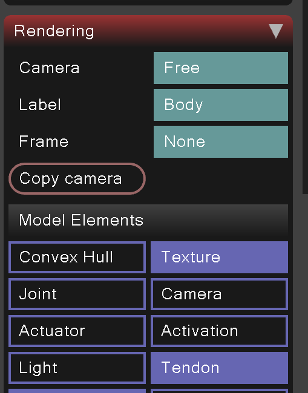
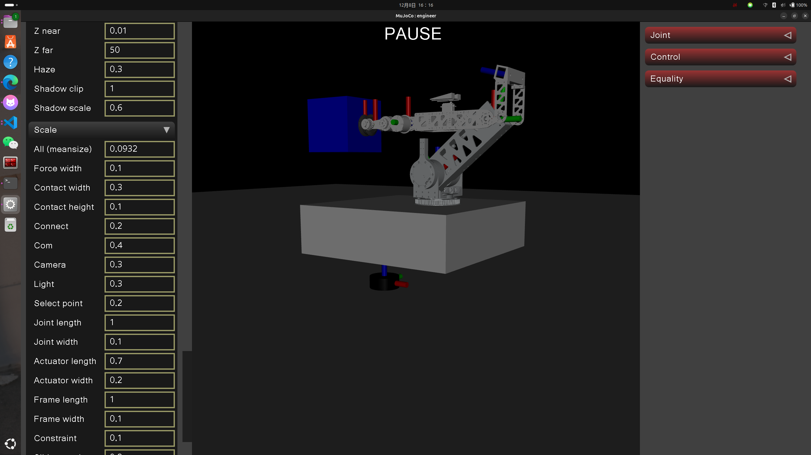

# 搬家用的

## 常用的
```bash
--cmake-args -DCMAKE_EXPORT_COMPILE_COMMANDS=YES
--cmake-args -DCMAKE_BUILD_TYPE=RelWithDebInfo
```

## bug说明
1. opencv窗口不更新:需要在一个经常刷新的函数里面写上
`cv::waitKey(1);`

2. 关于matplotlibcpp 
- 使用`PyErr_Print();`可以在调用python函数失败时打印错误信息，帮助调试。
- 使用`const std::map<std::string, std::string>& keywords` 作为参数,像python那样子传递参数
        


## 关于相机的部分:
- [相机的描述的链接,记得锁定元素body-camera-principal](https://docs.mujoco.cn/en/stable/XMLreference.html#body-camera-principal)

## 关于加力矩,
### 1 按住ctrl 鼠标左键是旋转力矩
### 2 按住ctrl 鼠标右键是带方向的力

## 如果想要

## 常用的快捷键
> 根据xcy的习惯,现在simulate程序里面把仿真环境调好了会好一点,之后代码只是验证控制的
1. ctrl + A 是视角快速回到初始位置
2. `是显示AABB(最小外接矩形)，这个就是碰撞体积
3. 调试坐标系可以在,这个label立选body
   - 如果想要坐标系小一点,调整visual里面的scale  
4. 